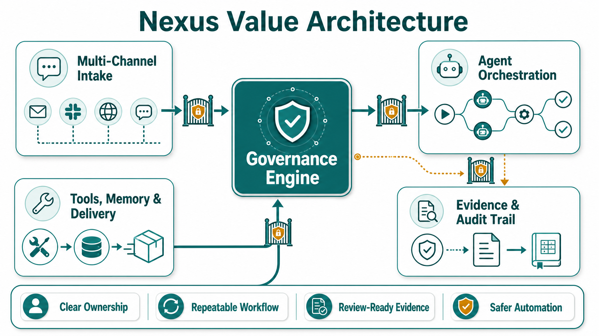
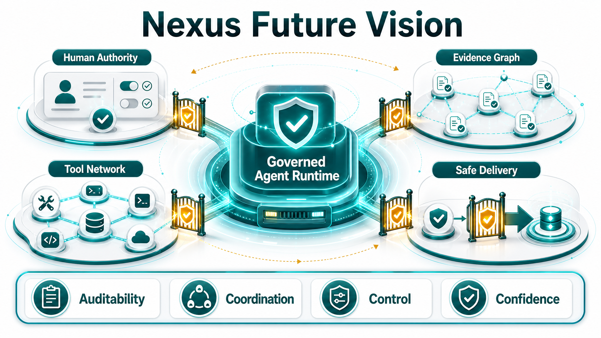

# Nexus

Nexus is an early-stage open-source governance runtime for agentic software delivery.

It focuses on a problem every serious multi-agent system eventually hits: once agents can plan, code, review, test, and hand work to each other, teams need a way to decide what is allowed, what happened, who approved it, and when a result is safe to promote.

Nexus provides a Python-based foundation for governed delivery workflows:

- role and authority models for human/agent collaboration;
- state machines for gated delivery stages;
- runtime lifecycle, readiness, and heartbeat patterns;
- evidence records for review, UAT, and release decisions;
- fail-closed controls for unsafe or incomplete automation.

The project is under active early-stage development. It is not a claim of autonomous production readiness.



## Why Governed Agentic Delivery Matters

Agentic tools can produce code quickly, but speed alone does not answer the hard delivery questions:

- Was this action authorized?
- Which runtime performed it?
- What evidence proves it?
- Did tests and UAT actually run?
- Was a failure handled safely?
- Who is allowed to promote the result?

Nexus treats these as first-class engineering concerns. The goal is not to make agents unrestricted; the goal is to make agentic work observable, reviewable, and bounded.

## Who Nexus Is For

Nexus is for builders experimenting with agentic development systems who need more than prompt orchestration:

- maintainers who want audit trails for AI-assisted work;
- teams exploring human-in-the-loop release gates;
- researchers studying safe multi-agent coordination;
- developers building runtime adapters, test gates, and evidence-first workflows.

## Core Ideas

- **Human authority boundaries**: business decisions, production actions, runtime promotion, and final acceptance are explicit gates.
- **Evidence-before-claim**: test results, UAT results, review decisions, and runtime events are recorded before promotion claims.
- **Fail-closed behavior**: blocked, missing, or unsafe prerequisites remain visible instead of being hidden by silent fallback.
- **Runtime lifecycle discipline**: candidate runtimes register, emit readiness and heartbeat signals, accept bounded assignments, and produce cleanup evidence.
- **Public-safe governance**: reusable patterns are documented without exposing private credentials, private operator context, or non-public evidence.

## Architecture

Nexus is organized around a few public-facing layers:

- **Governance model**: roles, authority tiers, gates, state transitions, and human approval boundaries.
- **Runtime and messaging layer**: Runtime Lifecycle Controller, Dispatch Controller, Candidate Agent Adapter, External Agent Runtime contracts, heartbeat/presence flows, and message contracts.
- **Evidence layer**: review records, UAT reports, event logs, and decision packages that make delivery traceable.
- **Delivery surfaces**: PMO CLI/UI, example game workflows, and integration/runbook artifacts.

The repository includes examples and evidence from active development. Some evidence is intentionally historical or experimental; public-facing docs should treat it as a record of governed development, not as a production deployment claim.

## Vision

Nexus aims to become a practical foundation for auditable multi-agent engineering: agents can do useful work, but the system keeps authority, evidence, and promotion decisions visible.



Near-term goals:

- improve public documentation and contributor onboarding;
- separate stable public examples from internal/historical evidence;
- add lightweight CI for repeatable checks;
- document the governance model and runtime lifecycle in standalone docs;
- keep safety claims precise and evidence-backed.

## Project Status

Nexus is an active early-stage project.

The 4.19 multi-channel agent runtime compatibility WBS is officially complete as of 2026-06-06 with the governance status `ALEX_ACCEPTED_4_19_OFFICIALLY_COMPLETE`. That status means the 4.19 controlled-validation and documentation gates are accepted. It does not authorize production deploy, live-readiness promotion, always-on runtime operation, credential/config mutation, or default-on dispatch.

Current public focus:

- clarifying the governance model for external readers;
- improving the README, roadmap, contribution path, and issue hygiene;
- documenting safe examples of evidence-first delivery;
- strengthening runtime lifecycle examples without claiming production readiness.

An OpenAI Codex for Open Source application has been submitted for Nexus. No OpenAI approval, credits, grant, selection result, or benefit has been received or claimed.

See [PROJECT_STATUS.md](PROJECT_STATUS.md) and [ROADMAP.md](ROADMAP.md).

## Quick Start

Requirements:

- Python 3.12+
- a local virtual environment is recommended

```bash
python -m venv .venv
source .venv/bin/activate
pip install -r requirements.txt
pip install -e .
```

Run the public example game:

```bash
python games/grid_escape.py --grid ge-001
```

Run available tests:

```bash
python -m pytest
```

Some historical scripts in the repository were created for specific sprint gates and may require their original environment. The public docs will continue moving stable workflows into standard commands.

## Repository Map

```text
nexus/
  mq/                         Runtime lifecycle, dispatch, Candidate Agent Adapter, evidence, and MQ contracts
governance/
  cli/                        PMO command-line surfaces and task/action inventory
  control/                    Local governance control models and task store helpers
  collab/                     Collaboration protocol experiments and workflow records
  routing/                    Routing engine components
  ui/                         Governance dashboard surfaces
games/
  grid_escape.py              Public agent-playable example workflow
docs/
  runbooks/                   Runtime and operating environment runbooks
evidence/
  */                          Historical evidence records and governed delivery traces
tests/                        Test coverage for public and internal surfaces
```

## Core Module Vocabulary

Use these names in active documentation and implementation notes:

- **Runtime Lifecycle Controller** owns runtime supply state: registration, readiness, heartbeat freshness, lifecycle control, eligibility decisions, and reservation leases.
- **Dispatch Controller** owns dispatch-side intent validation, dispatch run records, assignment publish requests, duplicate replay handling, and evidence collection. It does not own runtime registration/readiness/heartbeat.
- **Candidate Agent Adapter** is the candidate-runtime-facing adapter API/CLI for connection, registration, readiness, heartbeat, assignment intake, result events, and state reconciliation.
- **External Agent Runtime** refers to a bounded runtime instance outside the governance core that can register, report readiness, heartbeat, and receive assignments through approved contracts.
- **Resident Controller Service Package** refers to the default-off service package for resident controller operations. It remains gated unless explicitly authorized and configured.

Historical evidence, branch names, and archived filenames may still contain older terms. Treat those as literal records, not current module names.

## Contributing

Contributions are welcome, especially in documentation, tests, issue triage, safety review, and small runtime examples.

Start with [CONTRIBUTING.md](CONTRIBUTING.md), [ROADMAP.md](ROADMAP.md), and open issues labeled `good first issue` or `documentation`.

## Security

Please do not open public issues for sensitive vulnerabilities, credentials, or private operational context. See [SECURITY.md](SECURITY.md).

## License

This project is licensed under the Apache License 2.0. See [LICENSE](LICENSE).
